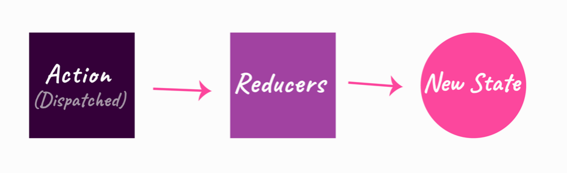
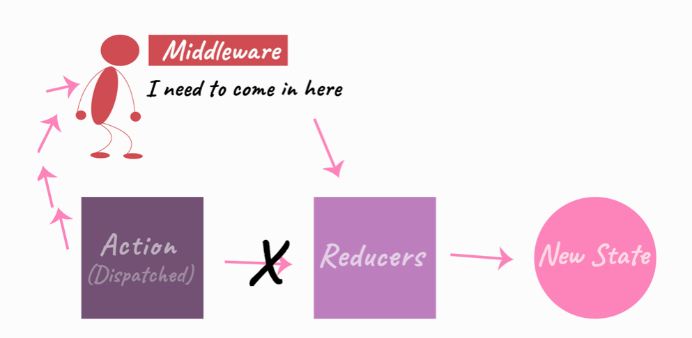

# Redux

## Reducers

> En vez de modificar el estado directamente, especificas las modificaciones que quieres que ocurran con objetos planos llamados acciones. Entonces escribes una función especial llamada **reducer** que decide como cada acción transforma el estado de la aplicación.

## Recursos

- [Redux Oficial](https://es.redux.js.org/)
- [What Does Redux Do? (and when should you use it?)](https://daveceddia.com/what-does-redux-do/)
- [Meetup Oscar](https://www.meetup.com/es-ES/js-coders/events/256400816/) → [demo](https://gitlab.com/oscmedgon/reactreduxdemo) | [api](https://gitlab.com/oscmedgon/reactreduxdemoapi)

- [You Might Not Need Redux | Dan Abramov | @medium](https://medium.com/@dan_abramov/you-might-not-need-redux-be46360cf367)

- [[Redux] The Best Way to Store Data](https://www.youtube.com/watch?v=aJxcVidE0I0&feature=youtu.be)

- [📄Normalizing State Shape](https://redux.js.org/recipes/structuring-reducers/normalizing-state-shape)

  - [📺 Normalizing State Shape](https://egghead.io/lessons/javascript-redux-normalizing-the-state-shape)

- [`_.map`](https://lodash.com/docs/4.17.11#map)
- [`_.values`](https://lodash.com/docs/4.17.11#values)

### Objects vs Array for State

- [redux: state as array of objects vs object keyed by id](https://stackoverflow.com/questions/38445006/redux-state-as-array-of-objects-vs-object-keyed-by-id)
- 👉 [Here’s how to optimize the state shape of your React app with Redux](https://medium.freecodecamp.org/optimising-the-state-shape-of-your-react-app-with-redux-3a280e6ef436)
- [Redux Patterns: Add/Edit/Remove Objects in an Array](https://hackernoon.com/redux-patterns-add-edit-remove-objects-in-an-array-6ee70cab2456)

## Middlewares

normal

with middlewares

